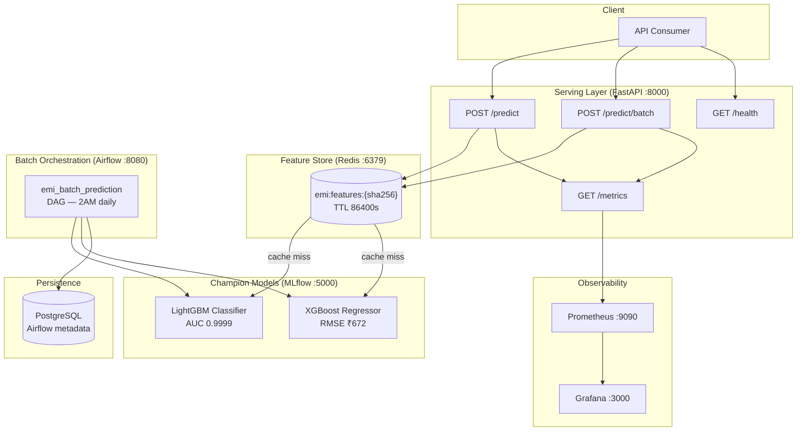

# EMI Predict AI


Production-grade end-to-end machine learning system for EMI risk prediction and eligibility scoring for an Indian financial institution. Built across 13 sections from raw data through to a fully monitored, containerised serving stack.

---

## Architecture



---

## Quick Start

**Prerequisites:** Docker Desktop running, ports 3000 / 5000 / 6379 / 8000 / 8080 / 9090 free.

```bash
# 1. Clone and configure
git clone <repo-url> && cd "Proj 3 EMI prediction"
cp .env.example .env          # set API_KEY and adjust paths if needed

# 2. Launch all 9 services
docker compose up -d

# 3. Verify the stack
python scripts/healthcheck_all.py
```

| Service | URL | Credentials |
|---|---|---|
| FastAPI docs | http://localhost:8000/docs | X-API-Key header |
| MLflow UI | http://localhost:5000 | — |
| Airflow UI | http://localhost:8080 | admin / admin |
| Prometheus | http://localhost:9090 | — |
| Grafana | http://localhost:3000 | admin / admin |

> **First run:** `airflow-init` runs once to migrate the DB and create the admin user. Wait ~60 s before accessing the Airflow UI. Trigger `emi_batch_prediction` manually in the UI to run your first batch.

---

## API Usage

### Single prediction

```bash
curl -X POST http://localhost:8000/predict \
  -H "Content-Type: application/json" \
  -H "X-API-Key: your-api-key-here" \
  -d '{
    "customer_id": "CUST-001",
    "age": 32,
    "gender": "Male",
    "marital_status": "Married",
    "education": "Graduate",
    "monthly_salary": 65000,
    "employment_type": "Salaried",
    "years_of_employment": 5.0,
    "company_type": "Private",
    "house_type": "Owned",
    "monthly_rent": 0,
    "family_size": 3,
    "dependents": 1,
    "school_fees": 2000,
    "college_fees": 0,
    "travel_expenses": 3000,
    "groceries_utilities": 8000,
    "other_monthly_expenses": 1500,
    "existing_loans": "None",
    "current_emi_amount": 0,
    "credit_score": 720,
    "bank_balance": 250000,
    "emergency_fund": 100000,
    "emi_scenario": "Conservative",
    "requested_amount": 500000,
    "requested_tenure": 36
  }'
```

**Response:**

```json
{
  "customer_id": "CUST-001",
  "clf_proba": 0.924371,
  "clf_label": 1,
  "conf_zone": "auto_approve",
  "predicted_emi": 15832.50,
  "cache_hit": false,
  "latency_ms": 42.7
}
```

**Confidence zones:**

| Zone | Probability | Action |
|---|---|---|
| `auto_approve` | > 0.85 | Instantly approve |
| `human_review` | 0.40 – 0.85 | Route to underwriter |
| `auto_reject` | < 0.40 | Instantly decline |

---

## Project Build — Section by Section

| # | Section | Key Deliverable | Headline Metric |
|---|---|---|---|
| 1 | Problem definition | `docs/section1_problem_definition.md` | Business framing |
| 2 | Data audit & EDA | `notebooks/00_data_audit.py`, `02_eda.py` | 404,800 rows, 32 cols |
| 3 | Baseline models | `src/models/baseline_rules.py`, `baseline_logistic.py` | Rule AUC 0.7956 → LR AUC 0.9763 |
| 4 | Feature engineering | `src/features/feature_engineering.py` | 42 total features (+21 new) |
| 5 | Model training | `src/models/train_classifier.py`, `train_regressor.py` | LightGBM AUC **0.9999**, XGBoost RMSE **₹672** |
| 6 | MLflow tracking | `notebooks/06_mlflow_experiments.py` | 9 experiments, champion aliases |
| 7 | Airflow ETL | `airflow/dags/emi_batch_prediction_dag.py` | 6-task DAG, 2 AM daily, versioned output |
| 8 | Redis feature store | `src/features/feature_store.py` | Cache-aside, 86400 s TTL, ~10× faster hits |
| 9 | FastAPI serving | `src/api/main.py` | 3 endpoints, X-API-Key auth, Prometheus middleware |
| 10 | Monitoring | `src/monitoring/drift_monitor.py`, `configs/grafana/` | 6 Prometheus metrics, 10-panel Grafana dashboard |
| 11 | Docker Compose | `docker-compose.yml` | 9 services, healthchecks, depends_on chains |
| 12 | Test suite | `tests/` (10 modules) | 54 tests, 76% coverage, 60% floor enforced |
| 13 | Documentation | `README.md`, `docs/`, `scripts/` | Production checklist, model card, runbook |

---

## Project Structure

```
.
├── airflow/
│   └── dags/
│       └── emi_batch_prediction_dag.py   # 6-task Airflow DAG
├── configs/
│   ├── prometheus.yml                    # local scrape config
│   ├── prometheus.docker.yml             # Docker scrape config
│   └── grafana/
│       ├── dashboards/emi_monitoring.json
│       └── provisioning/
├── docker/
│   └── airflow/
│       ├── Dockerfile                    # Airflow image + libgomp1
│       ├── requirements.txt
│       └── airflow_settings.yaml
├── docs/
│   ├── architecture.md
│   ├── api_reference.md
│   ├── model_card.md
│   ├── production_checklist.md
│   ├── runbook.md
│   └── figures/
├── models/                               # trained .pkl artefacts (not in git)
├── notebooks/                            # exploratory .py notebooks
├── scripts/
│   └── healthcheck_all.py
├── src/
│   ├── api/
│   │   ├── main.py                       # FastAPI app (v1.2)
│   │   ├── schemas.py                    # Pydantic models
│   │   └── dependencies.py
│   ├── data/
│   │   ├── load_data.py
│   │   └── preprocess.py                 # 17-step pipeline
│   ├── features/
│   │   ├── feature_engineering.py        # FeatureEngineer (21 new features)
│   │   └── feature_store.py              # Redis cache-aside
│   ├── models/
│   │   ├── baseline_rules.py
│   │   ├── baseline_logistic.py
│   │   ├── train_classifier.py
│   │   └── train_regressor.py
│   ├── monitoring/
│   │   └── drift_monitor.py              # Evidently two-layer drift
│   ├── pipelines/
│   │   └── predict_pipeline.py           # shared inference logic
│   └── utils/
│       └── leakage_checks.py
├── tests/                                # 54-test pytest suite
├── Dockerfile
├── docker-compose.yml
├── pytest.ini
└── requirements.txt
```

---

## Model Performance

| Model | Algorithm | Primary Metric | Secondary |
|---|---|---|---|
| EMI Eligibility Classifier | LightGBM | AUC **0.9999** | F1 **0.9922** |
| EMI Amount Regressor | XGBoost | RMSE **₹671.85** | R² **0.9916**, MAPE **7.59%** |

Training data: 387,287 rows · 42 features · class imbalance 4.2:1 (handled via `class_weight='balanced'`).

See [`docs/model_card.md`](docs/model_card.md) for full performance breakdown, limitations, and fairness notes.

---

## Running Locally (without Docker)

```bash
pip install -r requirements.txt

# Terminal 1 — FastAPI
$env:PYTHONPATH="."; uvicorn src.api.main:app --reload --port 8000

# Terminal 2 — MLflow UI
mlflow ui --backend-store-uri sqlite:///mlflow.db --port 5000

# Terminal 3 — Redis (Docker only)
docker run -d -p 6379:6379 --name emi-redis redis:7-alpine

# Run tests
pytest tests/ -v --cov=src --cov-report=term-missing
```

---

## Documentation

| Document | Description |
|---|---|
| [`docs/architecture.md`](docs/architecture.md) | Mermaid diagrams — real-time path, batch path, service dependencies |
| [`docs/api_reference.md`](docs/api_reference.md) | Endpoint specs, schemas, curl examples, error codes |
| [`docs/model_card.md`](docs/model_card.md) | Model performance, data provenance, limitations, fairness |
| [`docs/runbook.md`](docs/runbook.md) | Ops procedures — start/stop, DAG trigger, model rollback, alert handling |
| [`docs/production_checklist.md`](docs/production_checklist.md) | 50-item pre-production gate with verification commands |
