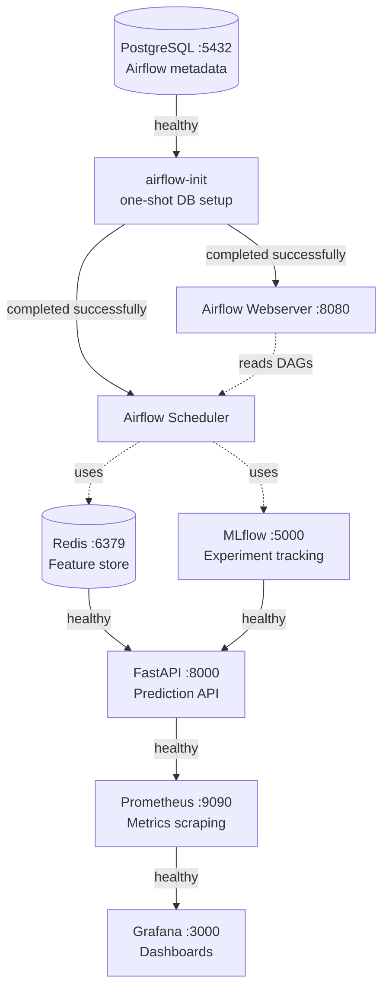
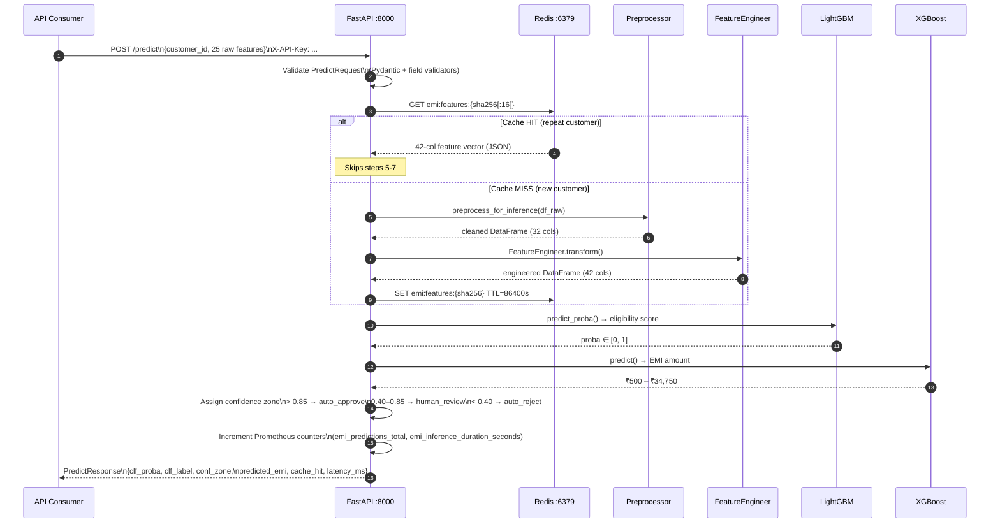
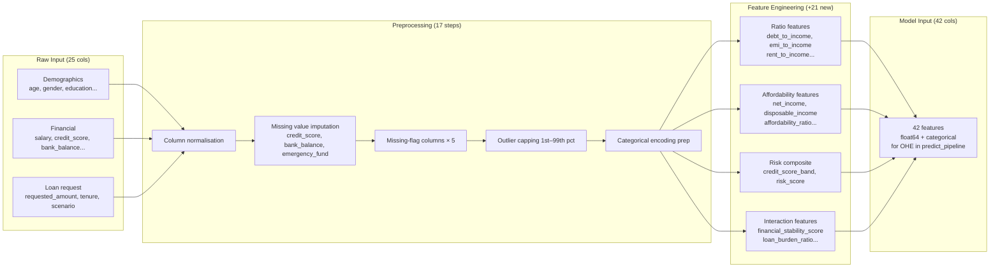
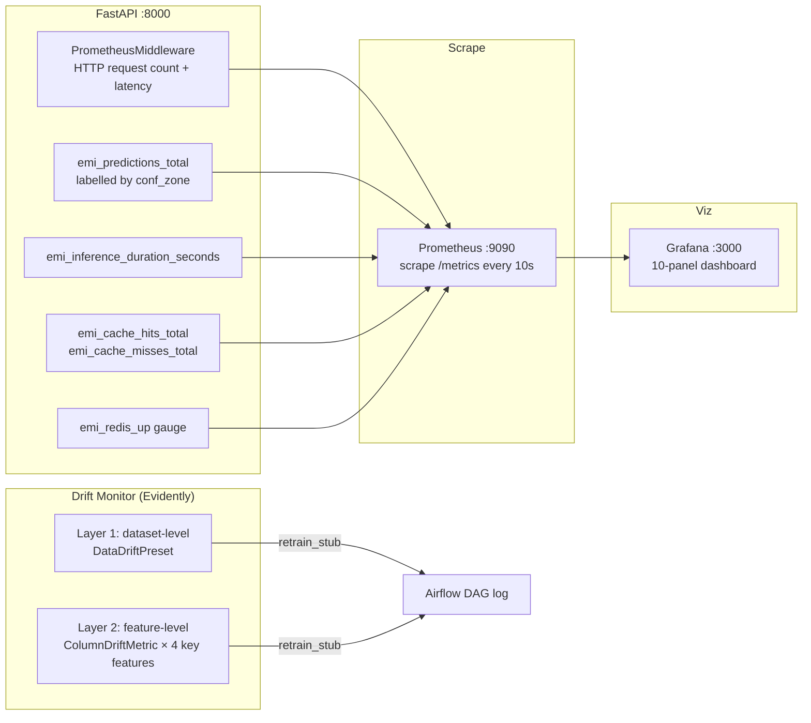

# EMI Predict AI — System Architecture

## 1. Service Dependency Graph

All 9 Docker Compose services with startup order and healthcheck dependencies.



**Startup sequence (approx):**
1. `postgres` + `redis` — no dependencies, start immediately
2. `mlflow` — no dependencies, starts in parallel
3. `airflow-init` — waits for `postgres` healthy
4. `fastapi` — waits for `redis` + `mlflow` healthy (~90 s total)
5. `airflow-webserver` + `airflow-scheduler` — wait for `airflow-init` completed
6. `prometheus` — waits for `fastapi` healthy
7. `grafana` — waits for `prometheus` healthy

---

## 2. Real-Time Prediction Path

Single-customer scoring via `POST /predict`. Cache-aside pattern reduces P99 latency ~10× on repeat customers.



**Typical latencies (local):**

| Path | P50 | P99 |
|---|---|---|
| Cache hit | ~5 ms | ~15 ms |
| Cache miss (full pipeline) | ~45 ms | ~120 ms |

---

## 3. Batch Prediction Path

Nightly DAG runs at 2 AM, processes `unlabeled_for_prediction.csv` (17,488 high-risk rows), writes versioned output, and checks for feature drift.

```mermaid
flowchart TD
    A([Airflow Scheduler\n2 AM daily trigger]) --> B

    subgraph DAG["emi_batch_prediction DAG (6 tasks)"]
        B[load_batch_data\nread unlabeled_for_prediction.csv]
        C[preprocess_batch\npreprocess_for_inference()]
        D[engineer_features\nFeatureEngineer.transform()]
        E[score_batch\nLightGBM + XGBoost predict]
        F[save_predictions\ndata/processed/predictions/{ds}/{run_id}/]
        G[retrain_stub\ndrift_monitor.run_drift_check()]

        B --> C --> D --> E --> F --> G
    end

    subgraph Storage
        H[(data/processed/\npredictions/\n{ds}/{run_id}/\npredictions.csv)]
        I[(data/processed/\ndrift_reports/)]
        J[(Redis\ncache warm-up)]
    end

    E -->|batch_write| J
    F --> H
    G --> I

    G --> K{Drift\ndetected?}
    K -->|Layer 1 or 2| L[Log warning\nAlert retrain stub]
    K -->|Clean| M([DAG complete])
    L --> M
```

**DAG configuration:**
- Schedule: `0 2 * * *` (2 AM daily)
- `catchup=False` — never back-fills missed runs
- `max_active_runs=1` — prevents concurrent batch overlap
- `retries=3`, `retry_delay=5 min` per task
- Output path: `data/processed/predictions/{execution_date}/{run_id}/predictions.csv` (immutable per run)

---

## 4. Feature Engineering Pipeline

Data flow from 25 raw API fields to 42 model-ready features.



---

## 5. Monitoring & Observability



**Grafana dashboard panels (10 total):**
1. Predictions per minute (rate)
2. Confidence zone distribution (pie)
3. Inference latency P50/P99 (histogram)
4. Cache hit rate (gauge)
5. Redis up/down (stat)
6. HTTP request rate by endpoint
7. HTTP error rate (4xx/5xx)
8. HTTP latency heatmap
9. Auto-approve / human-review / auto-reject counts (bar)
10. Models loaded status (stat)
